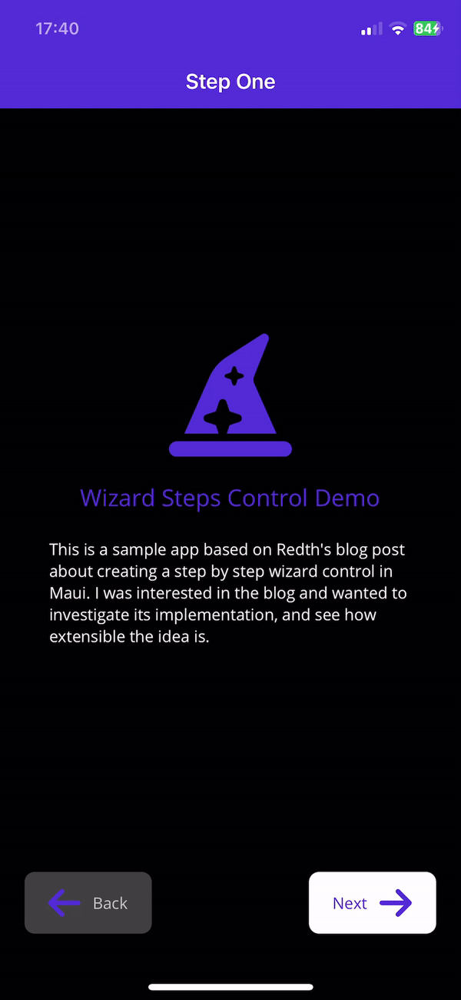

# Maui Wizard Demo
Proof of concept for building a form wizard in Maui.

Inspired by the [Building a Step-by-Step / Wizard Control](https://redth.codes/building-a-step-by-step-wizard-control-in-net-maui) blog post by [Redth](https://github.com/redth), since the full source code wasn't available. I wanted to use this wizard approach in an app and thought I'd make a proof of concept, implementing the blog code & then seeing how easy it is to modiy & add new features.

The results are quite good, I have been able to have a multi step form the user completes without page animations, this should be quite powerful to use since it allows a really slick UI for forms without a huge amount of code. I havent tried scroll views yet so mileage may vary.

Below is a gif of the sample app:

